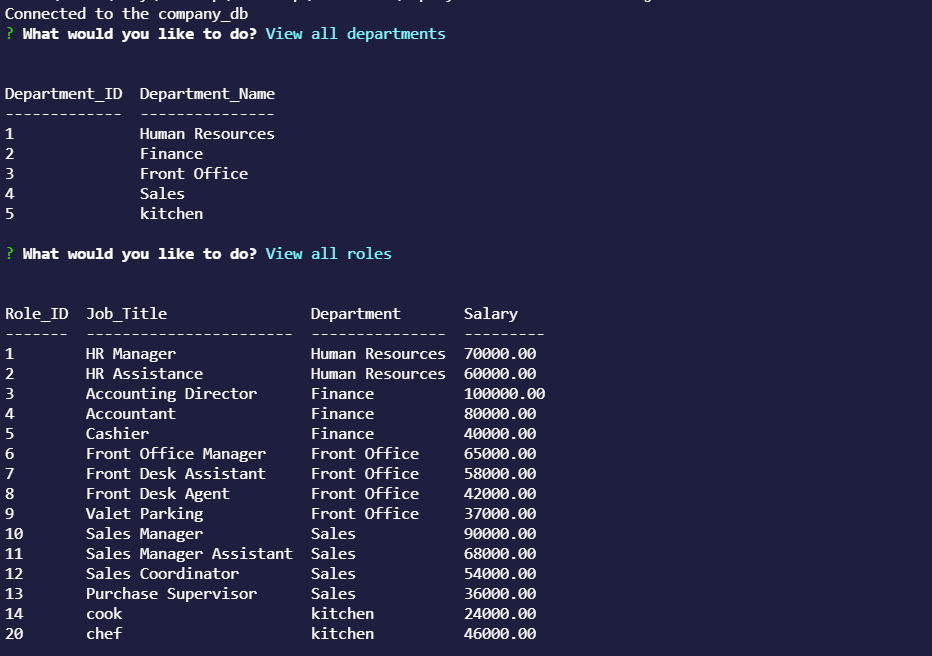
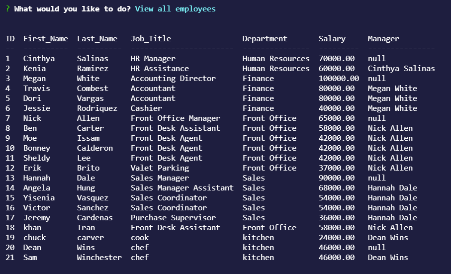
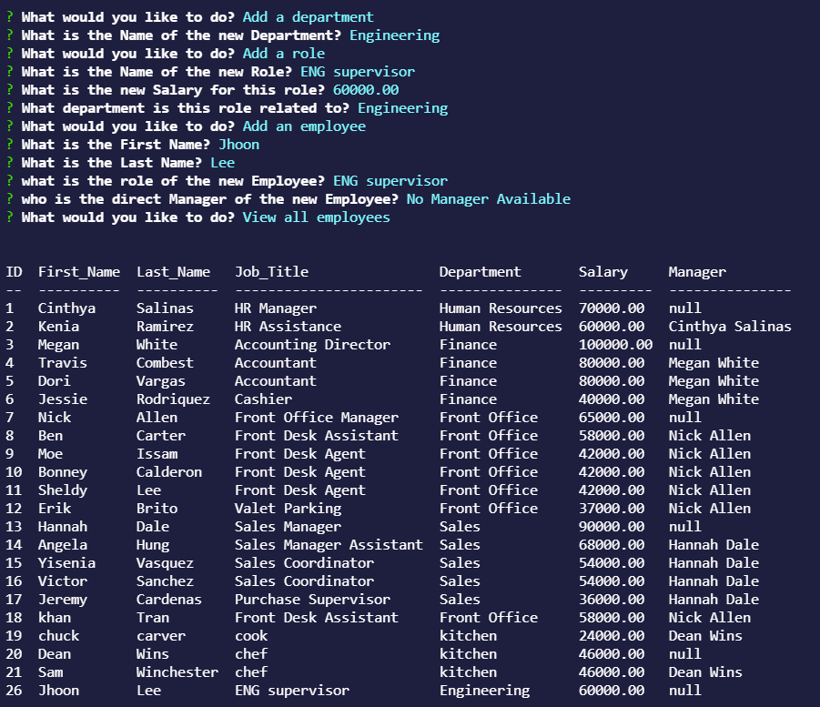
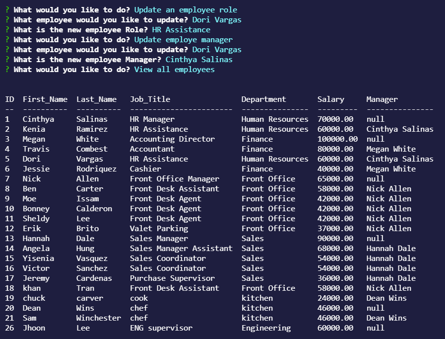
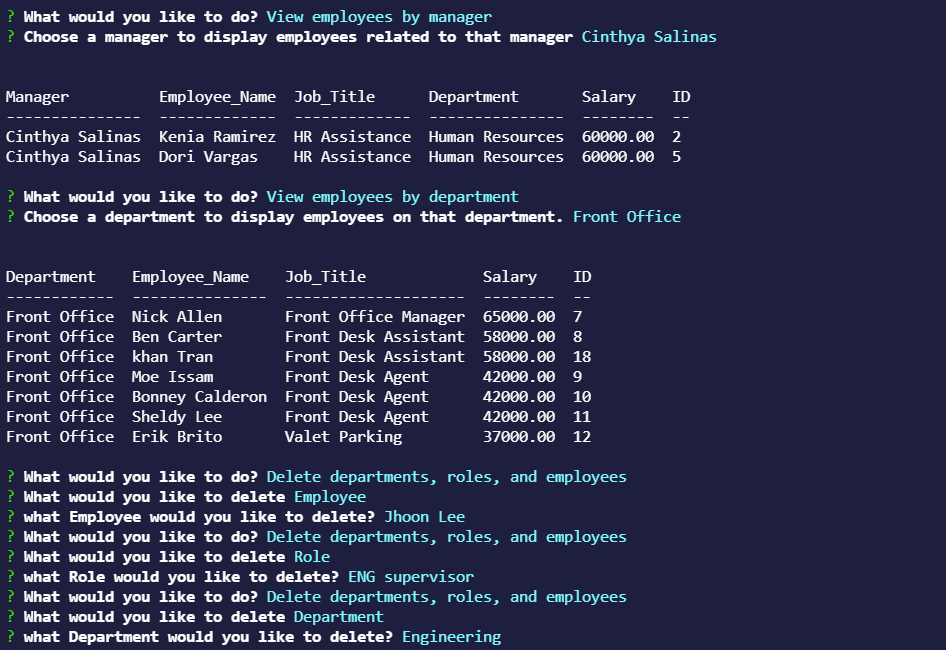
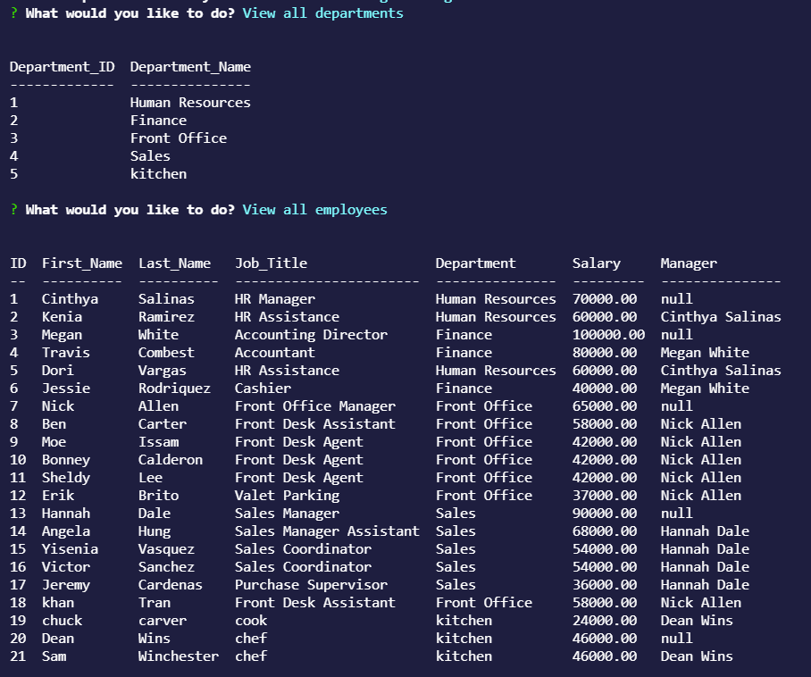
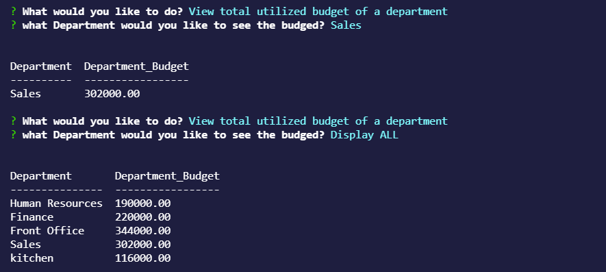

 

# Unit 12: Employee Tracker

## [Description](#description)

In this homework I created and interface that alows the user to easily view and interact with information stored in the database.

 This application uses a command line  to ask the user a series of questions to help navigate the user with the information stored in the database. The first three questions are about displaying what departments, roles and employees are available in the database. The next three questions asks the user to add a new department, add a new role or to add a new employee to the database. The next two questions are about updating an employee's role or an employee's manager. The next two questions are about displaying employee information by manager or by department. The next questions are about deleting by department, role or employee. The last question is about displaying the budget, there is an option to display by each department or to display all the departments. 

### Link to application:
Here is a screencapture video demostrating the functionality of the [application](https://watch.screencastify.com/v/Dgc6bgockCvGAMeZXhBy). If this link does not work, you can try [this one](https://drive.google.com/file/d/1urAkx0oRNZnvdTDeAiQnN3YWbN_9UmWs/view).

## Table of Content

* [Description](#description)
* [Installation](#installation)
* [Test](#test)
* [Usage](#usage)
* [License](#license)
* [Contributing](#contributing)
* [Questions](#questions)

## [Installation](#installation)
To initialie, run the following command.

    node index.js

## [Test](#test)
To run tests, run the following command

    no test available at this moment

## [Usage](#usage)

This application generates a series of command line questions to help the user navigate a company database. 

### Screenshot of Employee Tracker Comand Lines:

## [License](#license)

## [Contributing](#contributing)

none

## [Questions](#questions)

If you have any questions about the repo, or would like to contact me directly, 
here is my email: maribel.montes4@gmail.com. You can find more of my work at [Maribel Montes](https://github.com/MaryMD98).

